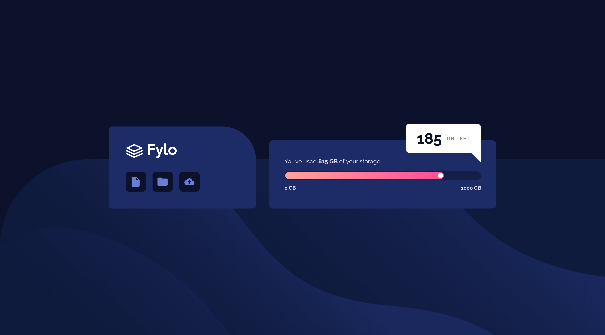

# Frontend Mentor - Fylo data storage component solution

This is a solution to the [Fylo data storage component challenge on Frontend Mentor](https://www.frontendmentor.io/challenges/fylo-data-storage-component-1dZPRbV5n). Frontend Mentor challenges help you improve your coding skills by building realistic projects. 

## Table of contents

- [Overview](#overview)
  - [The challenge](#the-challenge)
  - [Screenshot](#screenshot)
  - [Links](#links)
- [My process](#my-process)
  - [Built with](#built-with)
  - [What I learned](#what-i-learned)
  - [Continued development](#continued-development)
- [Author](#author)

## Overview

### The challenge

Users should be able to:

- View the optimal layout for the site depending on their device's screen size

### Screenshot



### Links

- Solution URL: [lucarl07/fylo-data-storage-component](https://github.com/lucarl07/fylo-data-storage-component/)
- Live Site URL: [Fylo Data Storage Component](https://lucarl07.github.io/fylo-data-storage-component/)

## My process

### Built with

- Semantic HTML5 markup
- CSS flebxox & custom properties
- Mobile-first workflow

### What I learned

With this challenge, I've learned how to create triangles in CSS based off of pseudo-elements. Styling the triangle to match the desktop design was mildly confusing at first, since I've initially used code from a project with a different approach. However, I got to the desired result by tweaking around with positional properties ("left", "right", etc.) and even removing some of them.

```css
/* ... */

@media screen and (min-width: 1024px) {
  /* ... */

  .info-badge::after {
    content: '';
    position: absolute;
    bottom: -1.5rem; /* Position it below the bubble */
    right: 0;
    width: 0;
    height: 0;
    border-left: 1.5rem solid transparent;
    border-top: 1.5rem solid white;
  }
}
```

### Continued development

Maybe there are cases in which I could use the calc() CSS function more. But in general, with these projects I'm doing lately, my major goal is to solidify my skills in semantic structuring and responsive styling.

## Author

- GitHub - [lucarl07](https://github.com/lucarl07)
- Frontend Mentor - [@lucarl07](https://www.frontendmentor.io/profile/lucarl07)

**Note: Delete this note and add/remove/edit lines above based on what links you'd like to share.**